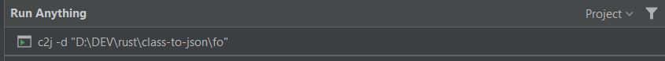

# class-to-json
Copy-paste tool to convert Java class to JSON object.     
Simple as `Copy -> c2j -> Paste`    
Generates JSON object with simple values inserted for each attribute.      
Comments, javadoc and annotations ignored.

## Quick Start
[VirusTotal report](https://www.virustotal.com/gui/file/4fa315b013d1bf77f96aa3688803508227315a01351a68806f528fa055164cec/detection)
1. Download pre-built binary `/bin/c2j.exe`
1. Put it to `windows/system32` so it can b invoked from everywhere
1. Copy class fields you would like to convert
    ```
    private String myString;

    /**
     * javadoc
     */
    public int myNumber;

    @DynamoDBRangeKey(attributeName = "SK")
    protected Currency curr;

    //comment
    private Clz clz;
    
    private ClassNotInDict notInDict;
    ```
1. Optionally create a `dict.txt` in `C:\Users\{username}\class-to-json` file with `{type}={value}` format   
See `dict-exmaple.txt`
    ```
    Currency=USD
    Clz={"a":333}
    ```
1. Run `c2j.exe` without any arguments   
1. Result
    ```
    {
    "myString" : "asd",
    "myNumber" : 1,
    "curr" : "USD",
    "clz" : {"a":333},
    "notInDict" : "default"
    }
    ```

## Use with IntelliJ "Run Anything"
`c2j.exe` should be present in `windows/system32`      
Then press `Ctrl` two times and type

`-d` is an optional argument to `dict.txt` file, if you don't want to store it in `~home` folder.   

## Use as command line
`c2j --help`   
